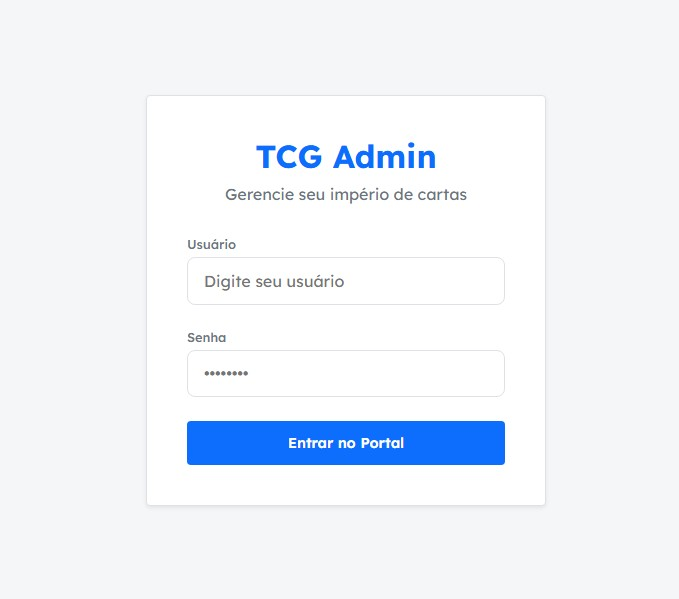
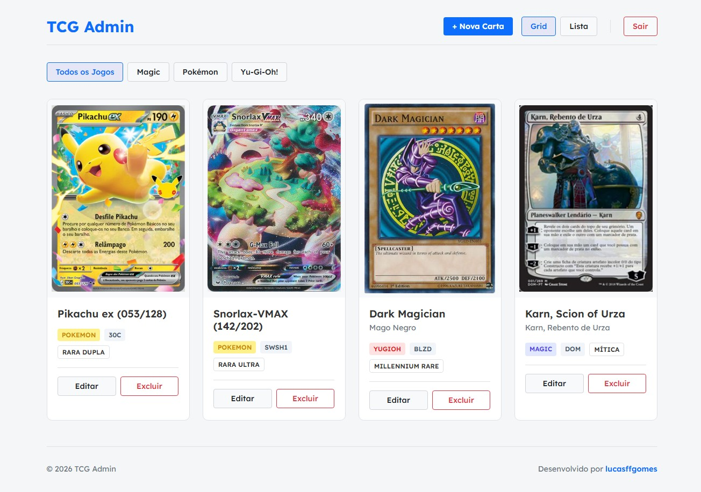

# Portal Administrativo - Gestão de Cartas

Este repositório contém o código de um Portal Administrativo voltado para a gestão de cartas (TCG), construído como parte de um desafio técnico Fullstack Frontend.

A aplicação é totalmente responsiva, utiliza dados dinâmicos diretamente do backend e traz uma interface moderna (Glassmorphism), pensada para usuários com diferentes níveis de familiaridade tecnológica.

### Preview da Aplicação

Aqui estão algumas prévias da interface final que você terá ao rodar o projeto:

<p align="center">
  
  
</p>

## 🚀 Como Inicializar o Projeto

A aplicação é completamente containerizada via **Docker**, garantindo que o ambiente suba de primeira, sem a necessidade de instalar PHP, MySQL ou Apache localmente.

### Pré-requisitos

- [Docker](https://www.docker.com/) e [Docker Compose](https://docs.docker.com/compose/) instalados.

### Passo a Passo

1. Abra o terminal na raiz do projeto.
2. Suba os containers da aplicação:
   ```bash
   docker-compose up -d
   ```
3. Aguarde cerca de 15 segundos para que o MySQL inicie e as tabelas sejam criadas pelo seed inicial.
4. Acesse a aplicação no seu navegador: **[http://localhost:8080](http://localhost:8080)**

## 🔐 Credenciais de Acesso

O banco de dados já inicializa pré-populado. Utilize a conta abaixo para acessar o dashboard:

- **Usuário:** `admin`
- **Senha:** `admin123`

## 🧠 Decisões de Arquitetura e UX

1. **Backend com PHP Puro (PSR-4 e MVC):** Apesar da restrição de frameworks, a estrutura foi desenhada usando o padrão PSR-4 com o Autoloader do Composer. O código é segmentado em Models, Controllers e rotas isoladas, resultando em uma API limpa, altamente escalável e madura.
2. **Respostas da API Padronizadas:** O uso de um `ResponseTrait` garante que todos os endpoints retornem um JSON previsível (`{ success, message, data }`).
3. **Sessão Segura (Mitigação XSS/CSRF):** Em vez do clássico JWT no localStorage, o acesso é mantido via sessão nativa do PHP, usando as diretivas de segurança `HttpOnly` e `SameSite: Strict`.
4. **Armazenamento Otimizado de Imagens:** O banco salva apenas a URL da imagem (armazenada fisicamente na pasta `storage/`), evitando o gargalo de performance causado por Base64 longo no banco de dados.
5. **Dados 100% Dinâmicos:** Filtros e abas de categorias conversam diretamente com o backend (via API), eliminando hardcodes e permitindo a adição flexível de novos jogos futuramente.

## 🖼 Imagens de Amostra

Na raiz do projeto há uma pasta `sample_images/` contendo mockups organizados por categoria. Você pode utilizá-los para testar o formulário de cadastro de cartas sem precisar procurar imagens na internet.

## ⚡ Comandos Úteis (Dicas)

Aqui estão alguns comandos rápidos do Docker para gerenciar a aplicação:

- **Derrubar tudo e limpar os dados (Reset total):**
  ```bash
  docker-compose down -v
  ```
- **Resetar e Subir novamente (Fresh Start):**
  ```bash
  docker-compose down -v && docker-compose up -d
  ```
- **Ver os logs da aplicação em tempo real:**
  ```bash
  docker-compose logs -f
  ```
